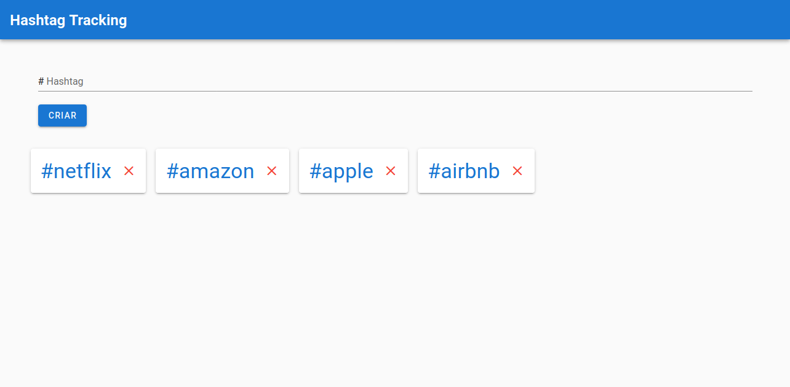

[](https://github.com/rafaelmatsumoto/hashtag-tracking)
[](https://github.com/rafaelmatsumoto/hashtag-tracking/issues)
[](https://travis-ci.com/rafaelmatsumoto/hashtag-tracking)


<br />
<p align="center">

  <h3 align="center">Tracker de hashtags</h3>

  <p align="center">
    API construída para cadastro e rastreio de hashtags
    <br />
    <br />
    <a href="https://hashtags-tracker-client.firebaseapp.com/#/">Demo</a>
  </p>
</p>


<!-- TABLE OF CONTENTS -->
## Conteúdo

- [Conteúdo](#conte%c3%bado)
- [Sobre o projeto](#sobre-o-projeto)
- [Getting Started](#getting-started)
  - [Pré-requisitos](#pr%c3%a9-requisitos)
  - [Instalação](#instala%c3%a7%c3%a3o)
- [Uso](#uso)
- [Licença](#licen%c3%a7a)
- [Contato](#contato)


<!-- ABOUT THE PROJECT -->
## Sobre o projeto



API construída para cadastro e rastreio de hashtags, desenvolvida para o teste da Magrathea Labs.

## Getting Started

Instruções para rodar o projeto localmente

### Pré-requisitos

* Ruby 2.6.5: https://github.com/rbenv/rbenv#installation
* Docker & Docker Compose: https://docs.docker.com/compose/install
* Credenciais do Twitter: https://developer.twitter.com/en/apply

### Instalação
 
1. Clonar o repositório
```sh
git clone https://github.com/rafaelmatsumoto/hashtag-tracking
```
2. Montar um arquivo **.env** baseado no arquivo **.env.template** substituindo as variáveis
3. Instalar as dependências
```sh
bundle install
```
4. Subir o servidor de banco de dados
```sh
docker-compose up -d
```
5. Inicializar o banco de dados
```sh
bundle exec rake db:create
bundle exec rake db:migrate
```

## Uso

É possível verficar e testar os end-points da aplicação a partir do arquivo [insomnia](./docs/insomnia.json). [Tutorial](https://support.insomnia.rest/article/52-importing-and-exporting-data) 

Para cadastrar tweets para cada hashtag deve-se rodar o comando

```sh
bundle exec rake twitter:pull_tweets
```

## Licença

Licença MIT. Consultar `LICENSE` para mais informações.

## Contato

Rafael Matsumoto - rafaelmatsumoto43@gmail.com

Projeto: [https://github.com/rafaelmatsumoto/hashtag-tracking](https://github.com/rafaelmatsumoto/hashtag-tracking)
